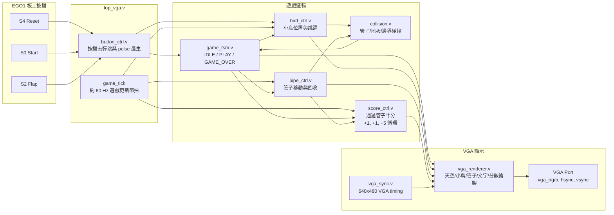

# EGO1 Flappy Bird FPGA Project

這是以 EGO1 FPGA 開發板實作的 VGA 版 Flappy Bird 小遊戲。最終展示版本使用板上按鍵操作，透過 VGA 輸出到螢幕或 VGA to HDMI 擷取設備。

## 最終功能

- 640x480 VGA 顯示
- START / GAME OVER 畫面文字
- pixel-art 小鳥、管子、天空、雲、地板紋理
- 左上角兩位數分數
- 碰撞判斷：管子、地板、畫面上緣
- 分數規則：每通過一根管子加分，第 1、2 根各 +1，第 3 根 +5，之後重複 `+1, +1, +5`

## 操作方式

| 功能 | EGO1 按鍵 |
| --- | --- |
| Reset | S4 |
| Start | S0 |
| Flap | S2 |

外接 NFU FPGA V2.0 keypad 擴充板因缺少該擴充板的 keypad 腳位表 / schematic / 範例 XDC，最終版不使用 keypad，避免 demo 不穩定。

## 主要檔案

```text
rtl/top_vga.v               最終 top module
rtl/vga_sync.v              VGA timing
rtl/vga_renderer.v          遊戲畫面繪製
rtl/game_fsm.v              IDLE / PLAY / GAME_OVER 狀態機
rtl/bird_ctrl.v             小鳥位置控制
rtl/pipe_ctrl.v             管子移動與回收
rtl/collision.v             碰撞判斷
rtl/score_ctrl.v            分數計算
rtl/button_ctrl.v           板上按鍵去彈跳 / pulse
constraints/ego1_vga.xdc    EGO1 VGA 最終約束檔
scripts/build_top_vga_flat.tcl
docs/signal_spec.md
docs/progress_log.md
```

`rtl/keypad_ctrl.v` 保留作為 keypad 掃描模組紀錄，但目前最終 top 不使用它。

## 系統總覽



## Build

目前最終 build 目錄放在 D 槽：

```text
D:\ego1_top_vga_build
```

Vivado batch build 指令：

```powershell
D:\Xilinx\Vivado\2017.2\bin\vivado.bat -mode batch -source build_top_vga.tcl -log build.log -journal build.jou
```

workdir：

```text
D:\ego1_top_vga_build
```

最終 bitstream：

```text
D:\ego1_top_vga_build\bitstream\top_vga.bit
```

## Demo 檢查

1. 燒錄 `D:\ego1_top_vga_build\bitstream\top_vga.bit`
2. 確認 VGA 畫面出現 START
3. 按 S0 進入遊戲
4. 按 S2 控制小鳥跳躍
5. 確認通過管子後分數為 `01 -> 02 -> 07 -> 08 -> 09 -> 14`
6. 撞到管子或地板後顯示 GAME / OVER
